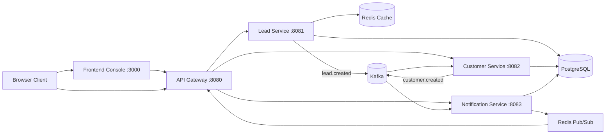
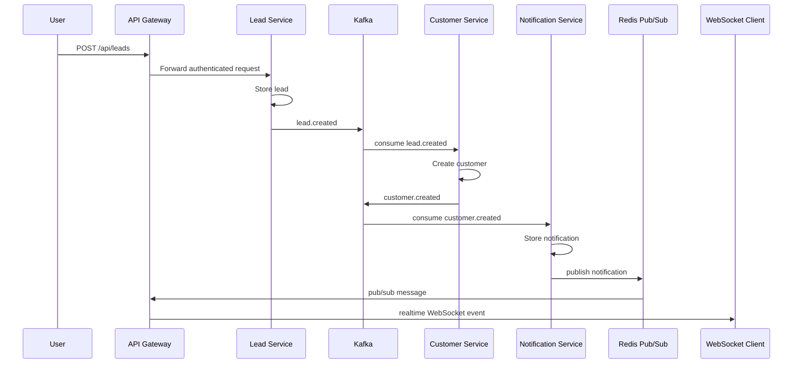
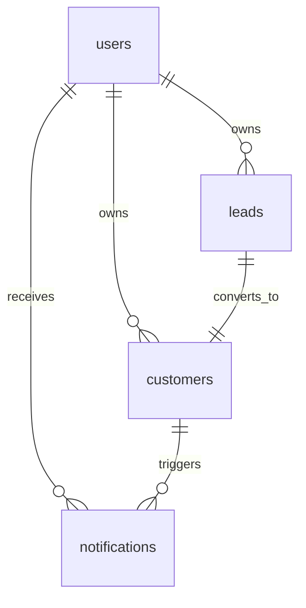

# Event Driven CRM Platform

Production-ready event-driven CRM backend built with Go, PostgreSQL, Redis, Kafka and WebSocket communication. The project is intentionally small enough to run locally, but structured like a backend system that can be deployed in Kubernetes/EKS-style environments.

## Overview

The platform models a compact CRM workflow:

1. A manager creates a lead through the API Gateway.
2. Lead Service stores the lead in PostgreSQL and publishes `lead.created`.
3. Customer Service consumes `lead.created`, creates a customer and publishes `customer.created`.
4. Notification Service consumes `customer.created`, stores a notification and publishes it through Redis Pub/Sub.
5. API Gateway broadcasts the Redis message to connected WebSocket clients.

## Technology Stack

- Go 1.25+
- Gin HTTP framework
- PostgreSQL with SQL migrations and pgx
- Redis for lead cache and WebSocket Pub/Sub
- Kafka with retry and DLQ topics
- JWT authentication with bcrypt password hashing
- Gorilla WebSocket
- Prometheus metrics
- OpenTelemetry tracing
- slog structured logging
- Browser dashboard frontend
- Docker Compose
- Testcontainers for integration tests

## System Architecture



## Event Flow



## Database Relationships



## Project Structure

```text
cmd/                         service entrypoints
frontend/                    browser console for local demo
services/                    domain service packages
internal/                    shared infrastructure packages
api/openapi.yaml             OpenAPI specification
deployments/docker/          service Dockerfiles
deployments/kubernetes/      Kubernetes deployment example
migrations/                  SQL migrations
tests/unit/                  fast unit tests
tests/integration/           testcontainers-based integration tests
docker-compose.yml           local full stack
Makefile                     common developer commands
```

## Run Locally

Prerequisites:

- Go 1.25+
- Docker and Docker Compose

Start the full platform:

```bash
docker compose up -d --build
```

If you use WSL and `make` works there:

```bash
make up
```

Useful URLs:

- Frontend console: `http://localhost:3000`
- API Gateway: `http://localhost:8080`
- Swagger UI: `http://localhost:8080/swagger/index.html`
- Kafka UI: `http://localhost:8088`
- Gateway metrics: `http://localhost:8080/metrics`

The frontend console is the easiest way to verify the system:

1. Open `http://localhost:3000`.
2. Click `Register` or `Login`.
3. Click `Создать заявку` or `Запустить демо`.
4. Open the `Заявки` and `Уведомления` tabs.
5. Watch the `Realtime` panel for WebSocket events.

Stop the stack:

```bash
docker compose down
```

## Make Commands

```bash
make up
make down
make build
make run
make migrate
make test
make test-integration
make lint
```

## Environment Variables

The repository includes `.env.example` with safe local defaults. Secrets are read from environment variables and are not hardcoded in Go code.

Important variables:

```env
POSTGRES_HOST=localhost
POSTGRES_PORT=5432
POSTGRES_USER=crm
POSTGRES_PASSWORD=crm
POSTGRES_DB=crm
REDIS_HOST=localhost
REDIS_PORT=6379
KAFKA_BROKERS=localhost:9092
JWT_SECRET=change-me
```

## API Examples

Register:

```bash
curl -s -X POST http://localhost:8080/auth/register \
  -H "Content-Type: application/json" \
  -d '{"email":"manager@example.com","password":"password123"}'
```

Login:

```bash
curl -s -X POST http://localhost:8080/auth/login \
  -H "Content-Type: application/json" \
  -d '{"email":"manager@example.com","password":"password123"}'
```

Create a lead:

```bash
curl -s -X POST http://localhost:8080/api/leads \
  -H "Authorization: Bearer <jwt>" \
  -H "Content-Type: application/json" \
  -d '{"name":"Ada Lovelace","email":"ada@example.com","company":"Analytical Engines Ltd","source":"landing-page"}'
```

List generated customers and notifications:

```bash
curl -s -H "Authorization: Bearer <jwt>" http://localhost:8080/api/customers
curl -s -H "Authorization: Bearer <jwt>" http://localhost:8080/api/notifications
```

## Kafka Events

`lead.created`:

```json
{
  "event_id": "2ff785ad-9e9b-4322-b195-87bca02dca5c",
  "event_type": "lead.created",
  "lead_id": "4f227fd6-17f3-4a69-8e38-1b5847c7c914",
  "user_id": "8b1f3bcf-4bb2-4b91-b8e6-3263e974a9d1",
  "name": "Ada Lovelace",
  "email": "ada@example.com",
  "company": "Analytical Engines Ltd",
  "source": "landing-page",
  "created_at": "2026-06-19T12:00:00Z"
}
```

`customer.created`:

```json
{
  "event_type": "customer.created",
  "customer_id": "46c01d2a-a10e-4880-af7c-368c7ea4ec16",
  "lead_id": "4f227fd6-17f3-4a69-8e38-1b5847c7c914"
}
```

Failed consumer messages are retried and then published to:

- `lead.created.dlq`
- `customer.created.dlq`

## WebSocket

Connect to:

```text
ws://localhost:8080/ws?token=<jwt>
```

Example realtime message:

```json
{
  "type": "customer_created",
  "customer_id": "46c01d2a-a10e-4880-af7c-368c7ea4ec16",
  "notification_id": "874a65fb-4604-4339-b299-18842d8b02fb",
  "message": "Customer Ada Lovelace was created from lead 4f227fd6-17f3-4a69-8e38-1b5847c7c914",
  "created_at": "2026-06-19T12:00:02Z"
}
```

## Observability

Every service exposes:

- `GET /health`
- `GET /ready`
- `GET /metrics`

Logs are structured JSON via `log/slog`. HTTP requests are instrumented with Prometheus counters/histograms and OpenTelemetry spans.

## Testing

Fast tests:

```bash
go test ./...
```

Integration tests use Testcontainers and are opt-in:

```bash
go test -tags=integration ./tests/integration
```

## Future Improvements

- Transactional outbox for exactly-once event publication around PostgreSQL writes.
- External OpenTelemetry collector and distributed trace backend.
- CI pipeline with Docker image publishing.
- Per-service database schemas if the deployment needs stricter ownership boundaries.
- Rate limiting and refresh tokens in the gateway.
